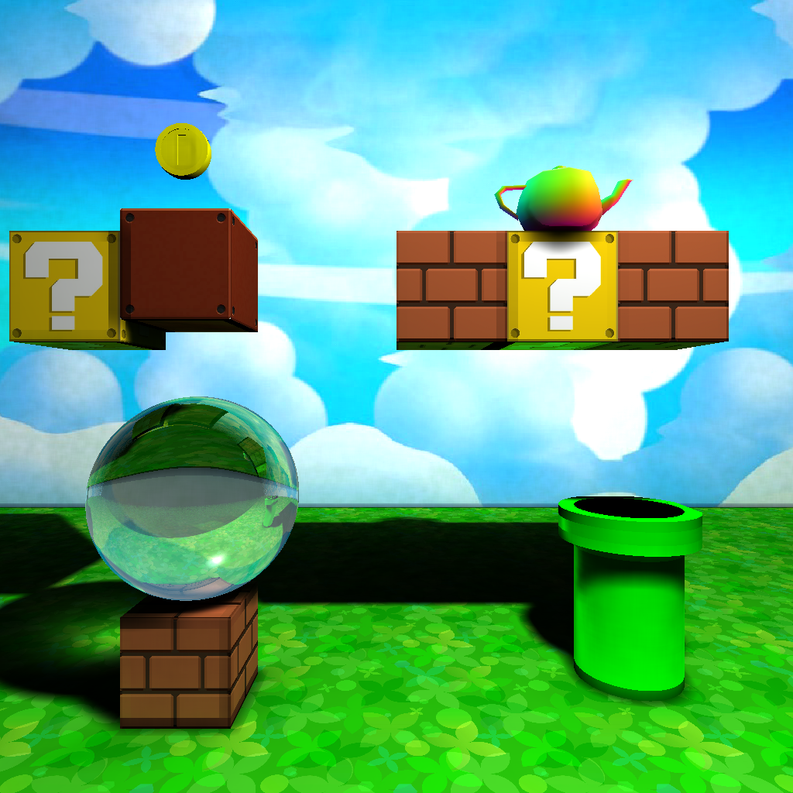

# Raytracing from scratch

This is a raytracer built from scratch in pure Rust, capable of rendering any scene in either raytracing mode or using Jensen's advanced [Photon Mapping](https://en.wikipedia.org/wiki/Photon_mapping) technique.
It doesn't use any libraries, not even OpenGL.

## Features

- Directional, positional and ambient lights
- Reflection, refraction and transparency using [Fresnel equations](https://en.wikipedia.org/wiki/Fresnel_equations)
- Quadratic surfaces and shapes ([Quadrics](https://en.wikipedia.org/wiki/Quadric))
- Constructive Solid Geometry ([CSG](https://en.wikipedia.org/wiki/Constructive_solid_geometry))
- Texturing for planar, spherical and cuboid surfaces including [normal maps](https://en.wikipedia.org/wiki/Normal_mapping)
- Jensen Photon mapping, including caustics

## How to run

With Rust installed and [FFmpeg](https://ffmpeg.org/download.html) in your PATH, simply run `cargo run --release`.

By default, it will render the scene in `scene2.txt`. You can specify another scene to render using `cargo run --release -- scene.txt` for example.

For simple scenes, the number of photons shot can be reduced in `src/environments/photon_scene.rs` to speed up the render. Inversely, the number can be increased for more realistic lighting.

FFmpeg is used to convert textures from PNG to PPM, and the output from PPM to PNG.
